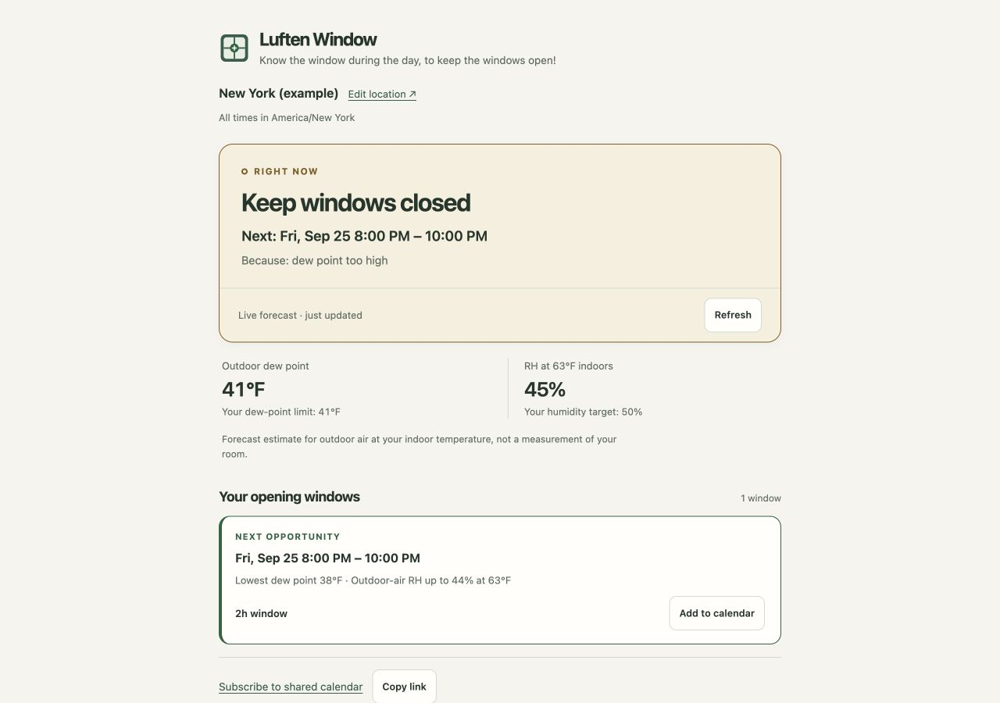
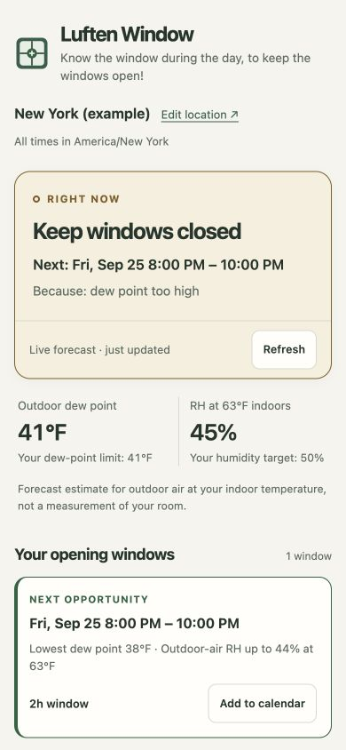

# Luften Window

Know the window during the day, to keep the windows open!

I wanted to know when I could leave my windows open throughout the day without constantly checking humidity levels. So I built Luften Window: an easy way to see which times of day are suitable for keeping the windows open in your region.

Choose your location and indoor humidity target. Luften Window uses the hourly weather forecast to show **when to open your windows, how long to leave them open, and when to close them**.

**Preview Luften Window without running it locally: [open the GitHub Pages app](https://lofihippo.github.io/Luften-Window/).**

| Desktop | Mobile |
| --- | --- |
|  |  |

- See today's opening times at a glance, with up to three days on the forecast chart.
- Adjust for your indoor temperature, humidity target, rain, wind and outdoor comfort.
- Save an individual opening window, subscribe to a shared calendar, or set up optional background notifications.
- Use the mobile-friendly light or dark interface, keyboard controls and hourly table.

The advice is forecast-based. The humidity estimate describes outdoor air at your chosen indoor temperature; it does not measure humidity inside your home.

## Add opening times to your calendar

**Subscribe once for ongoing updates**, or use **Add to calendar** on an individual window for a one-time `.ics` event using your current location and settings.

For Google Calendar, open it on a computer and choose **Other calendars → + → From URL**, paste the [shared calendar feed](https://lofihippo.github.io/Luften-Window/data/windows.ics), then choose **Add calendar**. Apple Calendar and Outlook also support calendar subscriptions; [see the setup guide](docs/setup.md#calendar-subscription) for their steps.

The shared feed is scheduled to refresh **hourly** as the humidity and weather forecast changes. Your calendar app controls when those changes appear, so a fresh update every morning is not guaranteed. Open the app for the latest advice.

**The demo feed is for New York (example).** Changing your browser settings does not change that shared subscription. For an automatically updating calendar for your region, [deploy your own copy](docs/setup.md#deploying-to-github-pages) with your location and humidity preferences.

## Try it locally

With Node.js 22 or newer, run:

```sh
npm run dev
```

Open [localhost:8080](http://localhost:8080) and choose your region in Settings. No package installation or build step is needed. The included location is New York as a public example.

## Learn more

- [Setup and usage](docs/setup.md) — settings, hosting, calendars, notifications and troubleshooting
- [Design and architecture](docs/architecture.md) — how the recommendations and app work
- [Development and verification](docs/development.md) — tests and remaining checks
- [Accessibility audit](docs/accessibility-audit.md)

Source code is available under the [MIT License](LICENSE). Weather data by [Open-Meteo](https://open-meteo.com/) ([CC BY 4.0](https://creativecommons.org/licenses/by/4.0/)).
